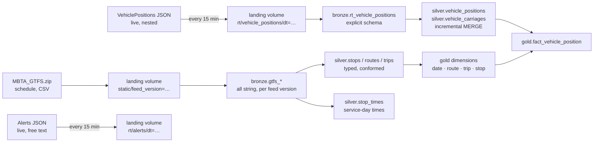
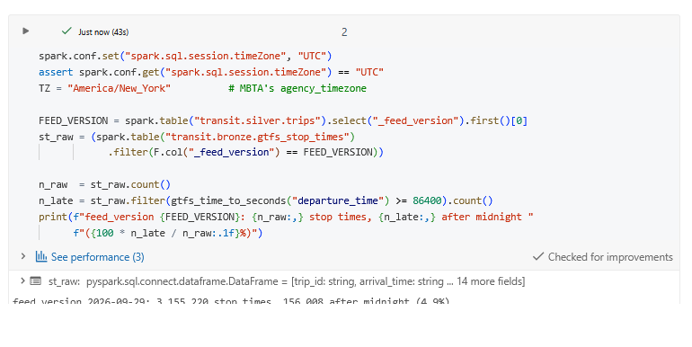
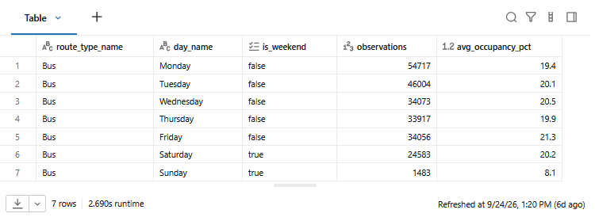
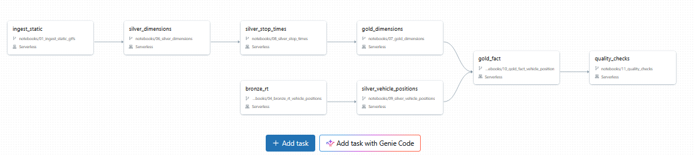
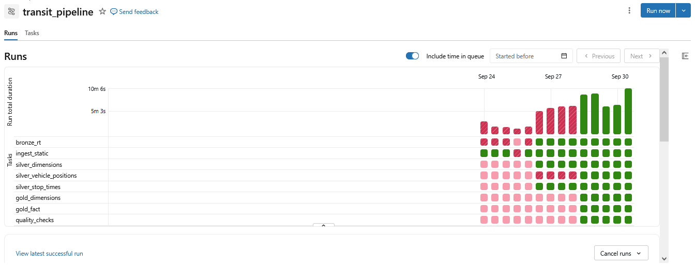

# MBTA Transit Lakehouse


A medallion-architecture lakehouse over Boston's public transit feeds, built on
Databricks with PySpark, Spark SQL and Delta Lake. Personal project, public data.

---

## The problem

The MBTA publishes two feeds that do not naturally talk to each other.

**GTFS Static** is the published schedule: stops, routes, trips and a timetable
of about 3.2 million scheduled stop times, as flat CSVs republished every few days.

**GTFS-Realtime** is where every vehicle is right now: deeply nested JSON,
refreshed continuously, with **no history**. It reports the present moment and
keeps no archive.

Answering anything that spans both — how actual service compares to the
published schedule — means landing both reliably, reconciling where they
disagree, and modelling them into something queryable.

---

## Architecture



| layer | what it holds |
|---|---|
| **Landing** | Raw files exactly as downloaded. Never modified; every bronze table can be rebuilt from here. |
| **Bronze** | One Delta table per source. Every source column is a string; metadata records when, from which file, and from which feed version each row came. |
| **Silver** | Typed, deduplicated, conformed. Realtime loaded incrementally with a watermark and an idempotent `MERGE`. |
| **Gold** | A star schema: four dimensions with stable surrogate keys and special members, and a fact table at a stated grain. |
| **Ops** | The pipeline's own records: ingestion log, watermarks, run history. |

Full design in [`docs/architecture.md`](docs/architecture.md).

---

## What the real data turned out to contain

**157,270 stop times (4.9%) fall after midnight.** GTFS writes a 1:15am departure
on the previous day's service as `25:15:00`. Parsed as an ordinary time, every
one becomes null with no error; under ANSI mode the whole query fails instead.
The fix stores seconds since the start of the service day.



**Daylight saving hides a second bug.** The spec measures times from *noon minus
12 hours*, not midnight. The two are identical except when clocks change — on
1 November 2026, inside this feed's validity window, a midnight-based conversion
puts every trip an hour off. Verified: `27:05:00` resolves to 03:05 correctly and
02:05 midnight-based.

**A declared schema silently dropped two fields.** The first explicit schema for
the realtime feed omitted `trip.revenue` and `trip.last_trip`, and Spark discarded
them without a warning. Every load now compares declared and actual fields and
fails if anything in the data is undeclared.

**MERGE duplicates silently before it fails.** One vehicle reported the same
position across 40 snapshots. Merged into an empty table without deduplicating,
it became 40 rows and raised no error; only the second run failed. The source is
collapsed to the grain before every merge.

**`monotonically_increasing_id()` is not a surrogate key.** Rebuilding the same
402 routes with a different partition layout changed every single key. Keys are
deterministic hashes of the natural key, proven stable across rebuilds.

**Most "unknown" trips aren't unknown.** 7.8% of vehicle observations referenced
a trip no dimension row matched. Tested against every schedule version, 97% were
trips MBTA added live and never published. They now resolve to a dedicated
"added trip" member; genuine mismatches are **0.24%**, all on one weekend whose
trips a later publication removed.

The full list, with numbers, is in [`docs/notes.md`](docs/notes.md).

---

## Design decisions

**Bronze stores everything as string.** A failed cast produces a silent null, so
typing on ingest makes "missing at source" indistinguishable from "we broke it".
Silver casts with `try_cast` and counts every value that fails.

**Realtime history is collected, not simulated.** The collector was the first
thing built, because it is the only part of the project that cannot be caught up
later. The snapshots contain genuine duplicates, gaps and frozen vehicles.

**Silver is one row per observation, loaded incrementally.** Each run reads
snapshots past a watermark (with a one-hour lookback), collapses them to
`(vehicle_id, vehicle_ts)`, and merges. Re-running changes nothing: three repeat
runs and a full reprocess from zero all inserted and updated 0 rows. The
watermark moves only after the merge commits.

**Unresolved keys are kept, not dropped.** Every dimension has an unknown member;
`dim_trip` also has an "added trip" member. Facts keep their natural ids so any
unresolved row can be traced.

**Monitor what can die quietly.** A notebook rename once broke the collector job
for a day without anyone noticing. It now alerts on failure, and the health check
reads the files the collector writes rather than the tables built from them.

Every decision and its reasoning: [`docs/design-decisions.md`](docs/design-decisions.md).

---

## A question the star schema answers

Average occupancy by mode and weekday, passenger-carrying trips only:

```sql
SELECT r.route_type_name, d.day_name, round(avg(f.occupancy_pct), 1) AS avg_occupancy_pct
FROM transit.gold.fact_vehicle_position f
JOIN transit.gold.dim_route r ON f.route_key = r.route_key
JOIN transit.gold.dim_date  d ON f.date_key  = d.date_key
WHERE f.is_revenue AND f.occupancy_pct IS NOT NULL
GROUP BY r.route_type_name, d.day_name, d.day_of_week
ORDER BY r.route_type_name, d.day_of_week
```



Only buses appear: rail reports occupancy per carriage, not per vehicle, so rail
occupancy lives at the carriage grain.

---

## It runs itself

One Databricks Workflow, eight tasks, scheduled daily at 04:00 UTC (midnight in
Boston, after the service day ends). Email on failure.



```
ingest_static -> silver_dimensions -> silver_stop_times -> gold_dimensions -+
                                                                            +-> gold_fact -> quality_checks
bronze_rt -> silver_vehicle_positions -------------------------------------+
```

The two branches are independent until `gold_fact`, so they run in parallel: the
realtime branch does not wait on a 30 MB schedule download it has no use for.
Splitting them took a run from **8m43s to 6m00s**.

`quality_checks` runs last, so a failing `error`-severity rule fails the whole
run rather than leaving bad data in gold looking finished.



The collectors are a separate job on their own 15-minute schedule. A pipeline
failure must never stop history being collected: the realtime feed keeps no
archive, so a missed interval is gone permanently. That is not hypothetical — a
notebook rename once broke the collector's job path and it failed silently for 25
hours, costing about 100 snapshots. See [`docs/runbook.md`](docs/runbook.md).

---

## Tested

66 tests against `src/`, run by GitHub Actions on every push, with `ruff` as a
lint gate before them.

| file | covers |
|---|---|
| `test_gtfs_time.py` | service-day parsing, times past 24:00, malformed input, the DST anchor |
| `test_rules.py` | every rule type, boundary values, batch evaluation matching single evaluation |
| `test_quarantine.py` | row splitting, multi-rule reason arrays, reconciliation, JSON round-trip |
| `test_vehicle_positions.py` | flattening nested JSON, grain collapsing, idempotency |

Tests run against a local Spark session in a fresh process — no cluster, no
notebook state. That is also the point: logic that lives in notebook cells cannot
be tested at all, which is why transformations live in `src/` and notebooks only
read, call, write and validate.

---

## How to run

Databricks Free Edition (serverless) with this repo connected as a Git folder.

| order | notebook | what it does |
|---|---|---|
| once | `00_setup_catalog` | catalog, schemas, landing volume |
| scheduled | `02_ingest_rt_snapshot`, `02_ingest_rt_alerts` | collectors, every 15 minutes |
| 1 | `01_ingest_static_gtfs` | download the schedule, write bronze |
| 2 | `04_bronze_rt_vehicle_positions` | realtime snapshots into bronze |
| 3 | `06_silver_dimensions` | stops, routes, trips |
| 4 | `08_silver_stop_times` | service-day time parsing |
| 5 | `09_silver_vehicle_positions` | incremental MERGE with quarantine |
| 6 | `07_gold_dimensions` | dimensions and surrogate keys |
| 7 | `10_gold_fact_vehicle_position` | the fact table |
| 8 | `11_quality_checks` | 34 rules, results to `ops.quality_results` |
| any time | `00_health_check` | collector freshness and table state |

Tasks 1-8 are the Workflow above. `03_bronze_idempotency`,
`05_silver_vehicle_positions_flatten` and `90_rejects_inspection` are
exploration notebooks, kept to show how decisions were reached.

Tests: `pip install -r requirements.txt && pytest`. Needs Java 17.

---

## Stack

Databricks (Free Edition, serverless) · PySpark · Spark SQL · Delta Lake ·
Unity Catalog · Databricks Workflows · GitHub

---

## Status

**Built:** collectors with failure alerting · static and realtime bronze,
idempotent and rebuildable from landing · silver dimensions, stop times and
realtime positions · incremental MERGE with watermarking · gold dimensions and
`fact_vehicle_position` · health checks.

**Next:** a config-driven data quality engine with quarantine (bad rows kept in
`ops.rejects` with a reason, never dropped) · moving shared logic into tested
modules in `src/` · pytest and GitHub Actions CI · one scheduled Workflow for the
whole pipeline.

**Later:** SCD Type 2 on stops · scheduled-service fact and measured optimisation ·
alerts text processing · deployment with Asset Bundles.

## Documentation

| file | what |
|---|---|
| [`docs/architecture.md`](docs/architecture.md) | layers, table reference, grains |
| [`docs/design-decisions.md`](docs/design-decisions.md) | every significant choice and why |
| [`docs/notes.md`](docs/notes.md) | what the real data turned out to contain, including where early assumptions were wrong |
| [`docs/runbook.md`](docs/runbook.md) | schedules, freshness targets, failure handling, recovery procedures, incidents |

---

## What I'd do differently at scale

**Ingestion.** Realtime bronze currently re-reads every snapshot and rewrites the
table. At ~670 files that costs 7 seconds, and it grows linearly. Auto Loader
tracks ingested files itself and removes the problem; silver would run as a
streaming job with an `availableNow` trigger rather than fixed batches.

**Keys.** Hash surrogate keys need no state and survive any rebuild, but they are
wide and unordered. At larger volumes, Delta identity columns with merge-loaded
dimensions give compact, stable integers.

**Layout.** Date partitioning is right for these volumes but produces small files
as history grows. Liquid clustering is the current recommendation and adapts
without a rewrite.

**Quarantine format.** Rejected rows are stored as JSON, and `to_json` drops null
keys — so restoring a reject needs the table's schema, not the JSON's. A schema
version per reject, or a `VARIANT` column, would keep structure with the data.

**Deployment.** Jobs are configured by hand in the UI, which is how a notebook
rename once broke a collector silently. Databricks Asset Bundles would put job
definitions in the repo and deploy them from CI, so a rename that breaks a task
fails a pull request instead of production.

**Governance.** Table and column descriptions live in the docs rather than in
Unity Catalog, and lineage is drawn by hand in a diagram rather than read from
the catalog's own lineage graph.
