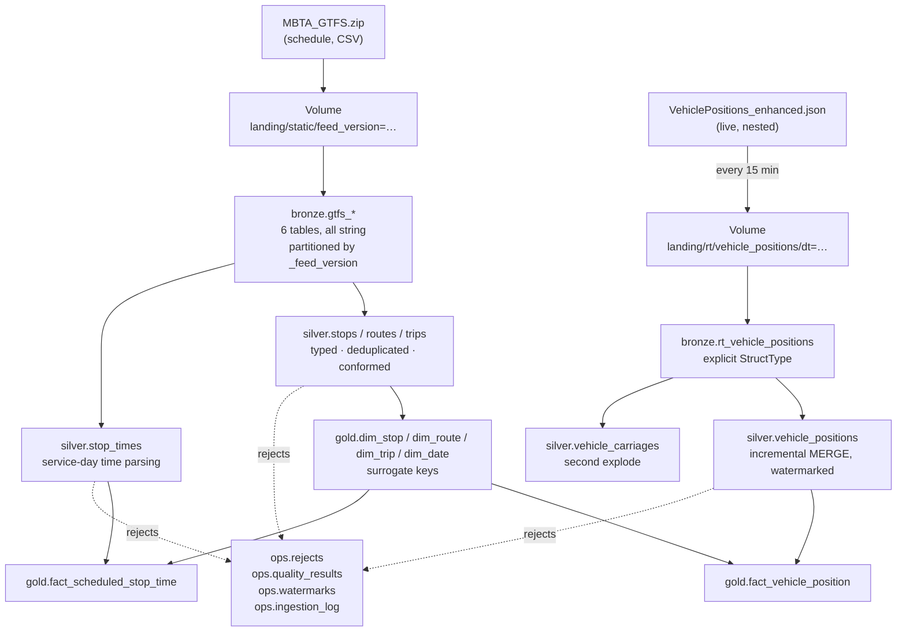

# Architecture

## Sources

**GTFS Static** — `https://cdn.mbta.com/MBTA_GTFS.zip`

A zip of CSVs describing the published schedule: stops, routes, trips, the
timetable, and service calendars. Republished every few weeks. Structured, flat,
relational. Becomes the dimensions.

**GTFS-Realtime** — `https://cdn.mbta.com/realtime/VehiclePositions_enhanced.json`

Where every vehicle is right now: position, bearing, occupancy, current stop,
trip assignment, and per-carriage detail on multi-car trains. Deeply nested JSON
with two array levels. **No history** — the endpoint reports the present moment
only. Becomes the facts.

---

## Flow

---

## Layers

**Bronze** — the source as it arrived. Every column from the source is string;
no casting, no cleaning, no business logic. Three metadata columns on every row:

| column | meaning |
|---|---|
| `_ingested_at` | when this row was written |
| `_source_file` | which file it came from, for tracing |
| `_feed_version` | which publication of the source |
| `_agency_feed_version` | the agency's own version string |

Static tables are partitioned by `_feed_version` and written with `replaceWhere`,
so re-ingesting a version replaces exactly that version and leaves the rest of
the history in place.

**Silver** — typed, deduplicated, conformed, with business rules applied. Rows
that fail validation are written to `ops.rejects` with a reason code rather than
filtered away, and each run asserts `valid + rejected = input`. Realtime data is
loaded incrementally via `MERGE` against an explicitly stated grain, with
watermarking so only new snapshots are read.

**Gold** — a star schema. Integer surrogate keys on every dimension, unknown
members at key `-1` for unresolved foreign keys, and an explicitly stated grain
on every fact table.

**Ops** — the pipeline's own records, kept out of the data tiers so a consumer
browsing `gold` never sees them.

---

## Table reference

### bronze

`gtfs_stops`, `gtfs_routes`, `gtfs_trips`, `gtfs_stop_times`, `gtfs_calendar`,
`gtfs_calendar_dates`, `rt_vehicle_positions`

All source columns string. Metadata columns on every row.

### silver

| table | grain | notes |
|---|---|---|
| `stops` | one row per stop per version | SCD2: `valid_from`, `valid_to`, `is_current`, `attr_hash` |
| `routes` | one row per route | `route_type_name` conformed from lookup |
| `trips` | one row per trip | FK to routes |
| `stop_times` | one row per trip per stop | `arrival_seconds`, `departure_seconds`, `departure_ts` |
| `vehicle_positions` | one row per vehicle per timestamp | MERGE target, watermarked |
| `vehicle_carriages` | one row per vehicle per timestamp per carriage | second explode |

### gold

| table | type | grain |
|---|---|---|
| `dim_date` | dimension | one row per calendar date |
| `dim_stop` | SCD2 dimension | one row per stop version |
| `dim_route` | dimension | one row per route |
| `dim_trip` | dimension | one row per trip |
| `fact_vehicle_position` | fact | one row per vehicle per snapshot, partitioned by `date_key` |
| `fact_scheduled_stop_time` | fact | one row per trip per stop per service date |

### ops

| table | contents |
|---|---|
| `ingestion_log` | row counts per table per ingestion |
| `watermarks` | last processed snapshot timestamp per source |
| `quality_results` | one row per rule per run: checked, failed, pass/fail |
| `rejects` | quarantined rows with reason codes |

---

## Notebooks

Numbered by layer, with gaps so new work can be inserted without renumbering.

| notebook | purpose |
|---|---|
| `00_setup_catalog` | catalog, schemas, volume. Run once. |
| `10_ingest_static_gtfs` | fetch zip, land files, write six bronze tables |
| `11_ingest_rt_snapshot` | **scheduled every 15 min.** Fetch and store raw bytes. |
| `90_spike_*` | exploration and one-time migrations, not pipeline steps |

`11` is a parallel branch rather than a sequential step — it runs on a schedule
independently of the rest of the pipeline, because the feed it reads has no
history and the snapshots have to be captured as they occur.

---

## Environment constraints

Databricks Free Edition, serverless compute:

- No `cache()` / `PERSIST` — expensive intermediates are materialised as Delta
  tables instead
- Maximum 5 concurrent job tasks, so the Workflow DAG stays mostly serial
- One SQL warehouse, 2X-Small
- Outbound internet limited to trusted domains until account verification
